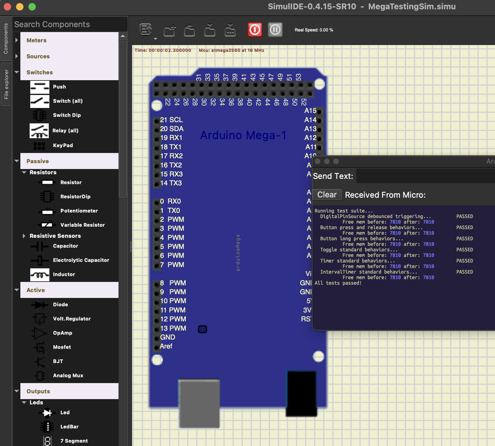

# TestTool

A unit testing framework for Arduino.

Written by Dan Mowehhuk (danmowehhuk@gmail.com)\
BSD license, check license.txt for more information\
All text above must be included in any redistribution

## User Guide

TestTool lets you create a test suite in a traditional Arduino `.ino` file, which you can run on a physical
Arduino device, or a simulator like [SimulIDE](https://simulide.com/p/). In addition to running tests, it
can also report free memory before and after each test to help catch memory leaks.



### Quick Start

In the root of your Arduino project, create a `test/test-suite` folder, and create a `test-suite.ino` file in it:

`test-suite.ino`:
```c
#include <TestTool.h>

void setup() {
  Serial.begin(9600);
  while (!Serial);

}

void loop() {}
```

Next, add one or more test functions to `test-suite.ino`. Test functions must return `void` and take a `TestInvocation*` as
an argument. In your `setup()` function, list these functions in a `TestFunction` array:

```diff
#include <TestTool.h>

+ void testSomething(TestInvocation* t) {
+   // test stuff
+ }

+ void testSomethingElse(TestInvocation* t) {
+   // test stuff
+ }


void setup() {
  Serial.begin(9600);
  while (!Serial);

+  TestFunction tests[] = {
+    testSomething,
+    testSomethingElse
+  };

}

void loop() {}
```

Finally, add one of the `runTestSuite...` functions to your `setup()`:
```diff

void setup() {
  Serial.begin(9600);
  while (!Serial);

  TestFunction tests[] = {
    testSomething,
    testSomethingElse
  };

+   runTestSuite(tests);

}

```

## Test Runner Functions

While `runTestSuite(tests)` is the simplest, there are other options when running your test suite.

- `runTestSuite(tests, 3)` - Runs each test 3 times if you want to check for inconsistent results.
- `runTestSuite(tests, beforeFunction, afterFunction`) - You can provide functions of the form\
  `void myFunction()` to be run before and after each test. If you only have one, you can pass\
  `nullptr` for the other one.
- `runTestSuite(tests, beforeFunction, afterFunction, 3)` - Same as above, but runs each test 3 times.
- `runTestSuiteShowMem(tests)` - After each test, prints out what the free memory was before and\
  after. This is very useful for catching memory leaks.
- `runTestSuiteShowMem(tests, 3)` - Runs each test 3x, showing the memory status after each test run.
- `runTestSuiteShowMem(tests, beforeFunction, afterFunction)` - Same as earlier, but also printing\
  the memory status.
- `runTestSuiteShowMem(tests, beforeFunction, afterFunction, 3)` - Same as above, but runs each test\
  3 times.


## Writing Test Functions

The `TestInvocation` parameter passed into your test functions provides various `assert...` methods you can use
for testing. If an assertion fails, the following assertions will not be evaluated. Here is an example of a 
typical test function:

```c
void testSomething(TestInvocation* t) {

  // Optionally give the test a descriptive name, otherwise TestTool will use a
  // generic one when displaying test results
  t->setName("Test core functionality");

  // Make an instance of the thing you want to test
  MyThing thing(1, 2, false, "foo");

  // Write some assertions. The message is only displayed if the assertion fails.
  // Any boolean expression will work, and the test will fail if it evaluates
  // to false
  t->assert(thing.getSomeParam() == 1, "getSomeParam should have returned 1");
  
  // You can also use flash strings to save RAM
  t->assert(thing.isActive(), F("Expected thing to be active"));

  // There are convenience functions for checking strings. You can pass any
  // combination of RAM or flash strings.
  t->assertEqual(thing.getString(), F("foo"), "Expected 'foo'");

  // You can leave out the message parameter and a generic 'expected A but got B'
  // message will be used by default
  t->assertEqual(thing.getString(), "foo");
}

```

## Test Fixtures, `before()` and `after()`

Sometimes, you need to create an object in the global context and access it in multiple tests. When doing
this, it's a good idea to reset the shared object's state so 1) its behavior is predictable from test to 
test, and 2) so that memory readings are consistent from test to test.

`test-suite.ino`
```c
#include <TestTool.h>
#include "MyThing.h"

MyThing thing(1, 2, false, "foo");

// Reset the test fixture after each test
void after() {
  thing.reset();
}

// your test functions...


void setup() {

  ...

  // Notice the 2nd arg is nullptr because there's no "before()" function
  runTestSuite(tests, nullptr, after);
}

void loop() {}

```

