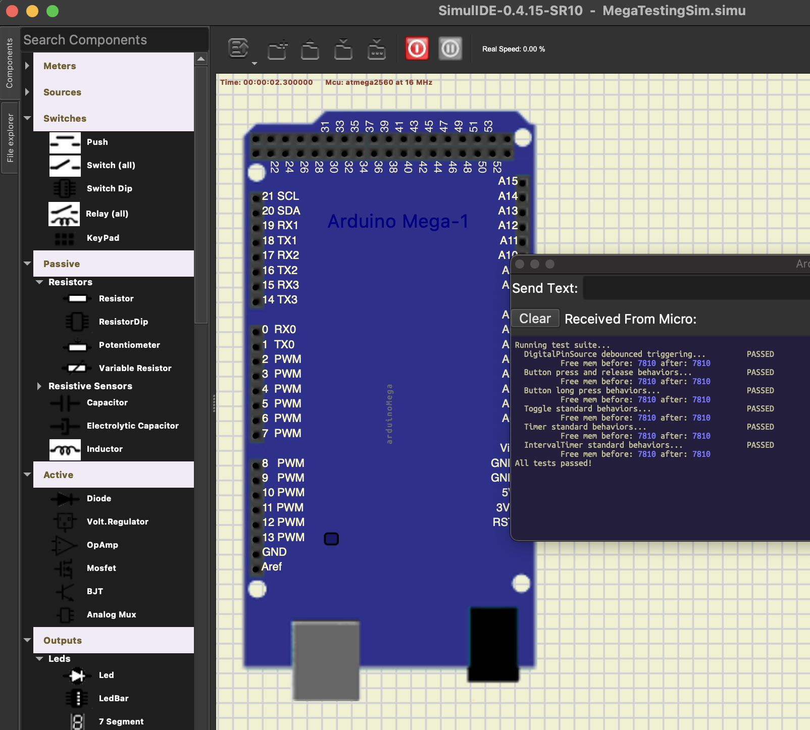

# TestTool

A unit testing framework for Arduino.

Written by Dan Mowehhuk (danmowehhuk@gmail.com)\
BSD license, check license.txt for more information\
All text above must be included in any redistribution

## User Guide

TestTool lets you create a test suite in a traditional Arduino `.ino` file, which you can run on a physical
Arduino device, or a simulator like [SimulIDE](https://simulide.com/p/). In addition to running tests, it
can also report free memory before and after each test to help catch memory leaks.



### Quick Start

In the root of your Arduino project, create a `test/test-suite` folder, and create a `test-suite.ino` file in it:

`test-suite.ino`:
```c
#include <TestTool.h>

void setup() {
  Serial.begin(9600);
  while (!Serial);

}

void loop() {}
```

Next, add one or more test functions to `test-suite.ino`. Test functions must return `void` and take a `TestInvocation*` as
an argument. In your `setup()` function, list these functions in a `TestFunction` array:

```diff
#include <TestTool.h>

+ void testSomething(TestInvocation* t) {
+   // test stuff
+ }

+ void testSomethingElse(TestInvocation* t) {
+   // test stuff
+ }


void setup() {
  Serial.begin(9600);
  while (!Serial);

+  TestFunction tests[] = {
+    testSomething,
+    testSomethingElse
+  };

}

void loop() {}
```

Finally, add one of the `runTestSuite...` functions to your `setup()`:
```diff

void setup() {
  Serial.begin(9600);
  while (!Serial);

  TestFunction tests[] = {
    testSomething,
    testSomethingElse
  };

+   runTestSuite(tests);

}

```

## Test Runner Functions

While `runTestSuite(tests)` is the simplest, there are other options when running your test suite.

- `runTestSuite(tests, 3)` - Runs each test 3 times if you want to check for inconsistent results.
- `runTestSuite(tests, beforeFunction, afterFunction`) - You can provide functions of the form\
  `void myFunction()` to be run before and after each test. If you only have one, you can pass\
  `nullptr` for the other one.
- `runTestSuite(tests, beforeFunction, afterFunction, 3)` - Same as above, but runs each test 3 times.
- `runTestSuiteShowMem(tests)` - After each test, prints out what the free memory was before and\
  after. This is very useful for catching memory leaks.
- `runTestSuiteShowMem(tests, 3)` - Runs each test 3x, showing the memory status after each test run.
- `runTestSuiteShowMem(tests, beforeFunction, afterFunction)` - Same as earlier, but also printing\
  the memory status.
- `runTestSuiteShowMem(tests, beforeFunction, afterFunction, 3)` - Same as above, but runs each test\
  3 times.


## Writing Test Functions

The `TestInvocation` parameter passed into your test functions provides various `assert...` methods you can use
for testing. If an assertion fails, the following assertions will not be evaluated. Here is an example of a 
typical test function:

```c
void testSomething(TestInvocation* t) {

  // Optionally give the test a descriptive name, otherwise TestTool will use a
  // generic one when displaying test results
  t->setName("Test core functionality");

  // Make an instance of the thing you want to test
  MyThing thing(1, 2, false, "foo");

  // Write some assertions. The message is only displayed if the assertion fails.
  // Any boolean expression will work, and the test will fail if it evaluates
  // to false
  t->assert(thing.getSomeParam() == 1, "getSomeParam should have returned 1");
  
  // You can also use flash strings to save RAM
  t->assert(thing.isActive(), F("Expected thing to be active"));

  // There are convenience functions for checking strings. You can pass any
  // combination of RAM or flash strings.
  t->assertEqual(thing.getString(), F("foo"), "Expected 'foo'");

  // You can leave out the message parameter and a generic 'expected A but got B'
  // message will be used by default
  t->assertEqual(thing.getString(), "foo");
}

```

## Test Fixtures, `before()` and `after()`

Sometimes, you need to create an object in the global context and access it in multiple tests. Because
global objects persist between tests, any state accumulated during one test will carry over into the next
unless the fixture is explicitly reset. Use `before()` to reset state to a known baseline before each
test, or `after()` to clean up after each test.

- Use `before()` when you want to guarantee a clean starting state (e.g., resetting a counter).
- Use `after()` when you need to clean up resources after a test (e.g., freeing heap allocations).
- Pass `nullptr` for whichever lifecycle callback you do not need.

`test-suite.ino`
```c
#include <TestTool.h>
#include "MyThing.h"

MyThing thing(1, 2, false, "foo");

// Reset the test fixture before each test so that each test starts
// from a known, clean state regardless of what previous tests did
void before() {
  thing.reset();
}

// your test functions...


void setup() {

  ...

  // Notice the 3rd arg is nullptr because there's no "after()" function
  runTestSuite(tests, before, nullptr);
}

void loop() {}

```

## Memory Profiling

`runTestSuiteShowMem()` prints free memory before and after each test. Stable readings (before ≈ after)
confirm that the test is not leaking memory. A consistently shrinking "after" value means memory that
was allocated during the test is not being freed.

The typical pattern is to free all heap allocations in `after()` so the memory baseline is restored
before the next test is measured:

```c
MyThing* thing = nullptr;

void after() {
  delete thing;
  thing = nullptr;
}

void testSomething(TestInvocation* t) {
  thing = new MyThing();
  // ... assertions ...
}

void setup() {
  ...
  runTestSuiteShowMem(tests, nullptr, after);
}
```

Example output:
```
Running test suite...
  Test something that passes.......................... PASSED
          Free mem before: 6842 after: 6842
  Test something else................................ PASSED
          Free mem before: 6842 after: 6842
All tests passed!
```

## Repeating Tests

Passing a repeat count runs each test multiple times before moving to the next. This is useful for two
reasons:

1. **Amplifying leaks**: A 2-byte leak per run becomes 10 bytes after 5 runs — much easier to spot in
   the memory readings.
2. **Catching non-determinism**: Tests that are flaky only on repeated invocations will eventually
   surface.

```c
// Run each test 5 times, showing memory after each run
runTestSuiteShowMem(tests, nullptr, after, 5);
```

## Examples

The `examples/test/` directory contains focused example test suites, each illustrating a single concept:

- `basic/` — Basic test functions, assertions, and all `assertEqual()` variants
- `memory-profiling/` — Using `runTestSuiteShowMem()` with `after()` to detect heap leaks
- `test-fixtures/` — Using `before()` to reset a shared fixture between tests
- `repeating-tests/` — Using the `repeats` parameter to amplify leaks and catch flaky behavior

